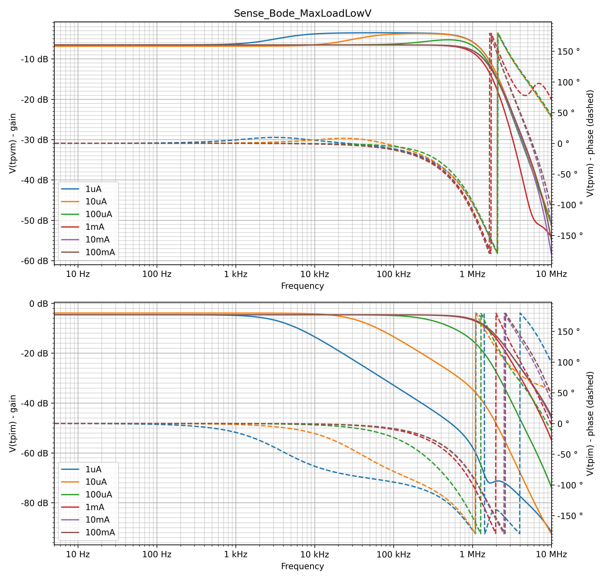

# LTSpBatchSim

The goal of the tool is to allow parameterized simulation runs on a spice circuit. It creates graphs, and uses transient analysis (```.TRAN```) or AC analysis (```.AC```) of LTSpice.

It is tested on MacOS, and should work identically under linux. It is not tested under windows, but it would be easy to adapt.

It is capable of creating one or more graphs per job (all in 1 png file), and multiple jobs per config file. Example:


See more examples below.

Only 1 signal will be shown per graph, but potentially in multiple lines, each one for a separate simulation.
Multiple output signals can be shown, but they will be each in their own graphs, one row per signal.
Each job is either a Transient analysis, either an AC analysis.
For transient analysis, different time scales or zoomed sections can be shown, each in their own column.
For AC analysis, gain and phase each have their own column, or be merged in the same column.

## Requirements for installation

* python3
* pip packages PyLTSpice, matplotlib (as usual: ```pip install -i requirements.txt```)
* WINE (the MacOS version of LTSPice is incomplete with regards to command line options, linux even has no choice)
* ltspice installed (and updated and run at least once manually) under wine

## Requirements for run

* a circuit, be it in .asc, .cir or .net format
* a json file describing the simulations to run

## How to run

Example:
```python3 ltspbatchsim.py opamptest.json```

See the output of ```python3 ltspbatchsim.py -h``` for more info.

```text
usage: ltspbatchsim.py [-h] [-v] [-vv] [--log] [--sim {ltspice,ngspice}] [--spicepath SPICEPATH] [--winepath WINEPATH] [--showpaths] [--outdir OUTDIR]
                       [--dryrun] [--use_asc] [--keep_simfiles] [--keep_logs] [--keep_raw] [--single_bode] [--dense]
                       config_file [job_name ...]

Runs one or more LTSpice or NGSpice simulations based on config from a json file.

positional arguments:
  config_file           Name of the config json file. Default: 'ltspbatchsim.json'.
  job_name              Name of the job(s) to run. If left empty: all jobs will be run. Wildcards can be used, but please escape the * and ? to avoid
                        shell expansion. Example of good use in shell: "test_OPA189\*", which will be passed on to this program as "test_OPA189*".

options:
  -h, --help            show this help message and exit
  -v, --verbose         Be verbose
  -vv, --debug          Be more verbose
  --log                 Log to file, not to console. If set, will log to "{config_file}.log", in append mode.
  --sim {ltspice,ngspice}
                        Simulator to be used, default: 'ltspice'.
  --spicepath SPICEPATH
                        Path of the spice executable.
  --winepath WINEPATH   Path of the wine executable, if used.
  --showpaths           Show the executable and library paths that can be detected automatically.
  --outdir OUTDIR       Output directory for the graphs, also work directory. Default: './batchsim/'.
  --dryrun              Do not run the simulations, just generate the simulation input files. This implies --keep_simfiles and can be used with --use_asc.
  --use_asc             Run the simulations directly from .asc files, not from .net files. There may be some bugs, so use with caution. This only works
                        with LTSpice.
  --keep_simfiles       After the runs, keep the simulation input files, be it .net or .asc (when used with --use_asc).
  --keep_logs           After the runs, keep the spice run logs.
  --keep_raw            After the runs, keep the .raw files.
  --single_bode         Keep AC analysis bode plots in the same graph, instead of having gain and phase in separate columns.
  --dense               Use this if the graph is dense. It will dash the lines, making distinction easier. Not used with '--single_bode'.
```

# the JSON config file format

```text
model: str
description: str
ylabel: str
ylabels: [str, ...]
ac: str
transients: [str, ...]
tstep: str
defs: dict(dict)
alt: int|bool
timeout: int
jobs: dict(dict)
 key: str
    |-op: str
    |-alt: int|bool
    |-ylabel: str
    |-ylabels: [str,...]
    |-ac: str
    |-transient: str
    |-transients: [str,...]
    |-traces: [str,...]
    |-commondefs: [dict|str,...]
    |-tracedefs: [dict|str,...]
```

* ```model```: the file name of the circuit.
* ```description```: description of the content of the file, used for logging. Not mandatory.
* ```timeout```: The maximum time that a simulation can run, in seconds. Default is None, which means that there is no timeout.
* ```ylabel```: See ```ylabels``` mentioned below. Used when only 1 value is needed.
* ```ylabels```: the signals to be shown. Each signal will get its own row. These are the default signals for all jobs, and can be overriden in the jobs.
* ```ac```: the default values for the AC analysis of all AC analysis jobs. Can be overriden in the jobs. Format is identical to the spice ```.ac``` op command. Ignored when Transient analysis is requested by the job.

    Exemple: ```"dec 200 5 10e6"```

* ```transients```: the default values for the time sections of all transient analysis jobs. Can be overriden in the jobs. Ignored when AC analysis is requested by the job.
  
    Format: ```[str, ...]```, where each ```str```, based on the spice ```.tran``` op command: "Tstop" or "Tstep Tstop" or "Tstep Tstop Tstart" (=> dTmax is not used). Additionally, a 'd' can be added at the end designating that this a dense graph, see '--dense'.

    For all of these times, the resolution is 1 nanosecond. The minimum and the default Tstep is 1ns. You can safely specify '0' as Tstep, and that will force 1 nanosecond.
  
    Example: ```["10u", "0 1010u 1000u", "0 2011u 2001u", "0 3011u 3001u", "4m d"]``` , creating a large graph with the following sub-graphs in columns:
  * 10 µsecs wide, starting at T0
  * 10 µsecs wide, starting at 1 msecs
  * 10 µsecs wide, starting at 2.001 msecs
  * 10 µsecs wide, starting at 3.001 msecs
  * 4 msecs wide, starting at T0, with dashed lines (to better differentiate them)
* ```defs```: a set of common component value definitions, to be referred to by the jobs and the traces

    Example:

```json
    "defs": {
        "HighV": {
            "R22": "300k",
            "V3": "100"
        },
        "LowV": {
            "R22": "20k",
            "V3": "10"
        },
        "Load_ON": { "V6": "1" },
        "Load_OFF": { "V6": "0" },
        "Load_Pulse": {
            "V6": "PWL(1u 0 +2n 1 +1m 1 +2n 0 +1u 0 +2n 1 +1m 1 +2n 0 +1m 0 +2n 1 +1u 1 +2n 0 +1m 0)"
        }
    }
```

* ```alt```: (true|false|1|0) Determine the use of the normal solver or the alternate solver. This is the default value. Can be overriden in the jobs. Only used for ltspice. Ignored on other simulators.
* ```jobs```: the definition of the jobs, a dictionary with job definitions. The key of the leements in the dict is the name of the job.
* ```job.op```: the type of analysis. Set to 'ac[N]' for AC analysis.
  * 'ac' for AC analysis bode plot creation according to the ```--single_bode``` command line setting
  * 'ac1' for AC analysis bode plot in a single graph
  * 'ac2' for a bode plot in separate gain and phase graphs
  * If absent, or any other value, a transient analysis is performed.
  * When using 'ac[N]', be sure to designate a signal source, and to define the signal level. Example: ```"V3": "0 AC 1"```
* ```job.alt```: Will override root level ```alt``` mentioned above.
* ```job.ylabel```: See ```job.ylabels``` mentioned below. Used when only 1 value is needed.
* ```job.ylabels```: Will override root level ```ylabels``` mentioned above.
* ```job.ac```: Will override root level ```ac``` mentioned above.
* ```job.transient```: Will override root level ```transients``` mentioned above. Used when only 1 value is needed.
* ```job.transients```: Will override root level ```transients``` mentioned above.
* ```job.traces```: List of the individual traces inside a graph. These names are not only printed, but also used to set component values. See ```job.tracedefs```.
* ```job.defs```: component value settings for all traces in the graph. Can be a ```str```, in which case it refers to a deinition in the ```defs``` section at the root of the json file. If it is a ```dict```, it is a key/value list of component names and values. It also accepts variables that are derived from ```traces```. If ```{name}``` is specified in a value in ```defs```, it will be substituted by the full name of the trace. If ```{nameN}``` is specified in a value in ```defs```, it will be substituted by the Nth part of the name of the trace, when split by comma or space.

    Examples:

```json
    {
    "defs": {
        "sense_1uA": { "RIsense": "5MEG" },
        "sense_10uA": { "RIsense": "560k" },
        "sense_100uA": { "RIsense": "50k" },
        "sense_1mA": { "RIsense": "5k" },
        "sense_10mA": { "RIsense": "500" },
        "sense_100mA": { "RIsense": "50" },
    },
    ...
    "jobs": {
        "job1" : {
            ...
            "defs": [{"C20": "10p"}, "sense_{name}"],
            "traces": ["1uA", "10uA", "100uA", "1mA", "10mA", "100mA"]
    ...
```

```json
  "jobs": {
    "job1" : {
      ...
      "defs": [
        {
          "XU6": "{name1}",
          "C3": "{name2}",
          "C4": "{name2}",
          "C21": "{name3}",
          "C22": "{name3}"
        }
      ],
      "traces": [
        "OPAx145, 27pf, 0pf",
    ...
```

# Examples of graphs

(The view below uses adaptive scaling, download to see the full resolution)




# Hints

You can use MacOS's LTSpice to draw and this tool (thus wine) to do the batched simulations. Just don't close MacOS's LTSpice _while_ doing a batch run, as it (by default) will delete the (temporary) .net file that got created by this tool.
